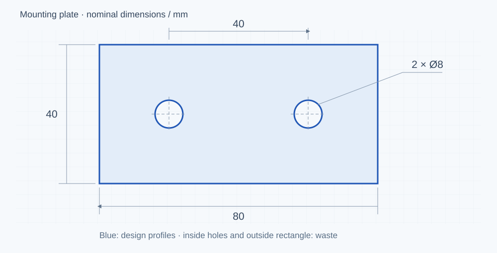

# 激光切割操作入门 · Laser cutting guide

从一张双孔连接片图纸开始，逐步完成图纸检查、加工路径、机器准备和首件检验。中文和英文使用同一套零件、图解与练习。

Follow a two-hole mounting plate from drawing checks through toolpath preparation, machine setup and first-part inspection. The Chinese and English editions share the same examples and exercises.

## 开始阅读 · Read the guide

| | 网页阅读 / Reader | GitHub 文档 / Markdown |
|---|---|---|
| 简体中文 | [进入教程](https://mx3353672833-debug.github.io/laser-cutting-guide/docs/zh-CN/00-start-here.html) | [第一章](docs/zh-CN/00-start-here.md) · [目录](docs/zh-CN/README.md) |
| English | [Open the guide](https://mx3353672833-debug.github.io/laser-cutting-guide/docs/en/00-start-here.html) | [Start here](docs/en/00-start-here.md) · [Contents](docs/en/README.md) |



## 一条路线，三个阶段 · One course, three stages

- **00–04**：在电脑上检查尺寸、分层、引线、补偿和模拟。Check dimensions, layers, leads, compensation and simulation.
- **05–09**：认识机器条件、定位、工艺与首件检查。Understand readiness, location, recipes and first-part inspection.
- **10–15**：学习恢复、排查、练习交付与嘉强迁移。Learn recovery, investigation, job handover and RayTools migration.

[8 个 DXF 与答案 / Exercises](exercises/README.md) · [中文术语](docs/zh-CN/glossary.md) · [Glossary](docs/en/glossary.md)

本教程区分手册依据、软件演示和真实加工。当前尚未完成匹配软件的逐步实测及实机切割验证，详见[版本与范围](docs/zh-CN/version-scope.md)。

The guide distinguishes documented behaviour, software demonstration and real machining. Matched-software walkthroughs and physical cutting trials remain unverified; see [scope](docs/en/version-scope.md).

## 维护 · Maintenance

[贡献 / Contribute](CONTRIBUTING.md) · [更新 / Changes](CHANGELOG.md) · [来源 / Attribution](ATTRIBUTION.md) · [License policy](LICENSE-POLICY.md)

```bash
python -m pip install -r requirements.txt
python scripts/check_content.py
python scripts/build_site.py
python scripts/check_site.py
```

The reader is generated from the same Markdown files. No second copy of the course is maintained.
