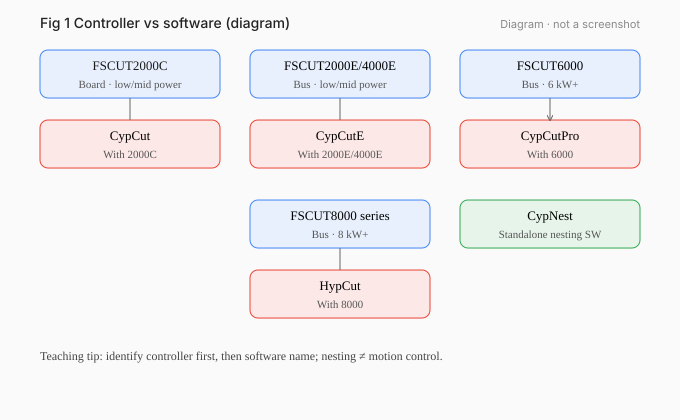

# 01 · Bochu Systems, Software, and Files

[简体中文](../zh-CN/01-bochu-systems.md) | [English](./01-bochu-systems.md)

[Previous / Before You Start: Learning Path and Practice Setup](00-start-here.md) · [Next / Import Drawings and Check Dimensions](02-import-drawings.md)

*Figure 01-1 diagram: controller on the machine, cutting software on the industrial PC. Not a screenshot.*

## What you will learn

Separate controller models, machining software, nesting software, document versions, and runtime versions; know what you can practice offline.

## Prerequisites and version scope

Concepts are general. Manual baselines: CypCutE V7.1 (based on **6.4.2310**); CypCutPro V1.0.0 (based on **7.1.2432.5**). Runtime not measured in this project.

## 1. Hardware system first, then software

| Controller | Product-line positioning (not a sole selection rule) | Software |
|---|---|---|
| FSCUT2000C | Low/mid power board | CypCut |
| FSCUT2000E | Bus, 1–4 kW class | CypCutE |
| FSCUT4000E | Bus, 1.5–8 kW class | CypCutE |
| FSCUT6000 | Bus, higher power class | CypCutPro |
| FSCUT8000 series | Bus, higher still | HypCut |

**CypNest** is separate nesting software and does not fire the laser.

## 2. Keep three version fields apart

1. **Document version** (cover), e.g. “Version 7.1”.
2. **Software version the manual is based on**, e.g. 6.4.2310.
3. **Runtime version** on the machine PC About page — not measured here.

Never write “manual 7.1” into a click-path as if it were the running software.

## 3. What works offline

| Software (from manuals) | Without hardware | Notes |
|---|---|---|
| CypCut (Dog-based manual) | No Dog → DEMO | Everything except motion control |
| CypCutE based on 6.4.2310 | No control card → demo mode | Design on a standalone laptop |
| CypCutPro based on 7.1.x | No control card → demo mode | Same idea |
| HypCut | Needs matching hardware; no demo wording found | To verify |

`Offline practice`: import, units, optimize, leads/kerf/micro joints, layer mapping, nesting, sorting, **software simulation**, save tasks.  
`Supervised on machine`: homing, edge finding, real frame/dry-run safety, first beam-on part.

## 4. Common file types

| Type | Use |
|---|---|
| DXF and similar | Geometry |
| *.lxd / *.lxds | Toolpaths |
| *.nrp / *.nrp2 | Nest packages |
| *.fsm | Material/layer process files (may be OEM-limited) |
| Task files (e.g. *.cps) | Zero, edge angle, breakpoint, drawing for job insert |

## 5. UI regions (CypCutE manual context)

Drawing board + machine envelope frame; menus File / Common / Draw / Nest / CNC / View; layer color buttons on the right with “do not machine”; last two layers may map to first/last machining order — always follow **your** software manual.

## 6. Example

Demo badge controller FSCUT4000E → CypCutE → record About runtime → prepare geometry in demo mode → header of notes: document version / based-on software / runtime.

## Exercises

1. Which machining software matches FSCUT6000? Which tool nests?
2. Write the three version lines.
3. List three offline and three supervised items.

## Answers and criteria

1. CypCutPro; CypNest.
2. Example: doc V7.1 / based on CypCutE 6.4.2310 / runtime not measured.
3. Offline: import, leads, simulate. Supervised: homing, edge finding, beam-on.

**Criteria**: pairs correct; version split correct; demo mode cannot cut.

## Common mistakes

- Applying the “no Dog” rule to E/Pro (their manuals say no **control card**).
- Treating CypNest as motion/laser control.

## Sources

- CypCutE User Manual V7.1 (based on 6.4.2310)
- CypCutPro User Manual V1.0.0 preface
- Public product/manual notes (see `version-scope.md`)

---

[Previous / Before You Start: Learning Path and Practice Setup](00-start-here.md) · [Next / Import Drawings and Check Dimensions](02-import-drawings.md)

[简体中文](../zh-CN/01-bochu-systems.md) | [English](./01-bochu-systems.md)
