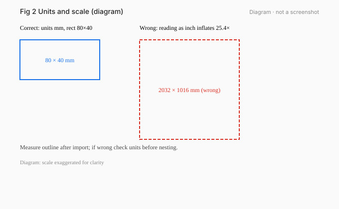
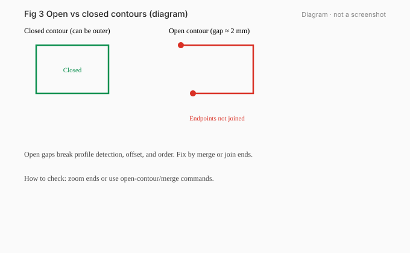
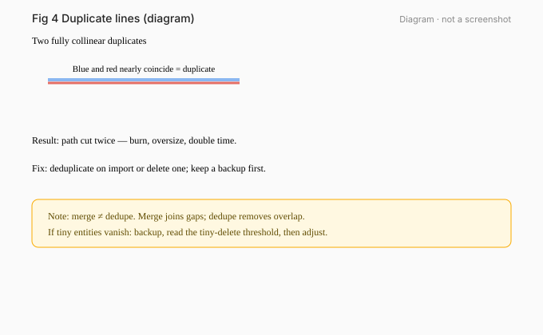

# 02 · Import Drawings and Check Dimensions

[简体中文](../zh-CN/02-import-drawings.md) | [English](./02-import-drawings.md)

[Previous / Bochu Systems, Software, and Files](01-bochu-systems.md) · [Next / Layers, Leads, Kerf, Micro Joints, and Cooling Points](03-leads-kerf-microjoints.md)

*Figures 02-1…02-3 diagrams.*

## What you will learn

After importing a DXF: check units, open ends, duplicate lines, and tiny entities; clean a practice drawing.

## Prerequisites and version scope

Chapter 01. CypCutE §1.4 import/optimize; CypCut tutorial “Optimize Drawing”.

## 1. Measure first

1. Import.
2. **Immediately measure a known edge** (running case long edge ≈ 80 mm).
3. Check units (`$INSUNITS` or import dialog).

If it shows about 2032 mm, the file was likely millimeter geometry read as inches (×25.4). Fix units/scale and re-measure; **keep the original file**.

## 2. Open vs closed

- Outer and inner contours should close to form outer/inner profiles.
- Use open-contour checkers or look for unpaired endpoints.
- Close gaps by drawing/extending — do not rely on kerf offset to “guess” them shut.

*Figure 02-4 exercise ex04: lower-left gap preview (drawn from DXF geometry).*

## 3. Duplicates and tiny entities

- Collinear duplicates get cut multiple times. Deduplicate until each edge remains once.
- Tiny entities may be removed by “delete tiny graphics” style optimizers. `Offline practice`: backup → read threshold and unit → compare import and record. Whether the threshold is right is `Pending machine verification`.

*Figure 02-5 exercise ex03: bottom-edge duplicates.*

## 4. Optimizer checklist (do → where → expect)

| Do | Where (CypCutE context) | Expect |
|---|---|---|
| Remove duplicates | cleanup tools | bottom edge reduced to one |
| Merge connected lines | same | fewer open ends |
| Delete tiny graphics | same, read threshold first | tiny segments go or stay (record) |
| Distinguish outer/inner | geometry process | outer frame and holes classified |

Button names vary by version.

## 5. Running case

*Figure 02-6 exercise ex01: 80×40 plate + two holes.*

Import ex01 → measure 80 / 40 → two holes inner → outer closed.

## Exercises

1. Open `exercises/dxf/ex02-wrong-units.dxf` and describe the size symptom and fix idea.
2. In ex03, locate duplicates.
3. In ex04, report both gap endpoints (coordinates).
4. Record an ex05 tiny-entity experiment (3 lines or mark pending).

## Answers and criteria

1. `$INSUNITS=inch` with mm-like geometry; ~25.4× inflation. Interpret as mm and measure.
2. Bottom edge (0,0)–(60,0) duplicated by LINE entities.
3. Endpoints **(0,0) and (0,2)**; gap at **lower-left**, missing segment length 2.
4. See `exercises/answers/en/ex05-tiny-entities.md`.

**Criteria**: measure first; endpoints correct; no single mandatory threshold claim.

## Common mistakes

- Editing kerf before measuring.
- Hoping compensation closes a gap.
- Deleting intentional teaching defects as corrupt files.

## Sources

- CypCutE import/optimize sections (based on 6.4.2310)
- CypCut tutorial Optimize Drawing
- `exercises/dxf-structure-report.json`

---

[Previous / Bochu Systems, Software, and Files](01-bochu-systems.md) · [Next / Layers, Leads, Kerf, Micro Joints, and Cooling Points](03-leads-kerf-microjoints.md)

[简体中文](../zh-CN/02-import-drawings.md) | [English](./02-import-drawings.md)
