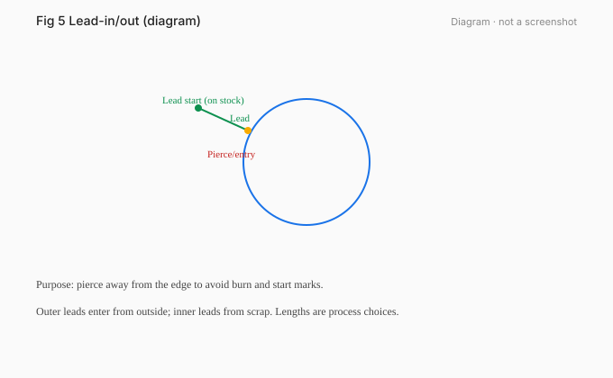
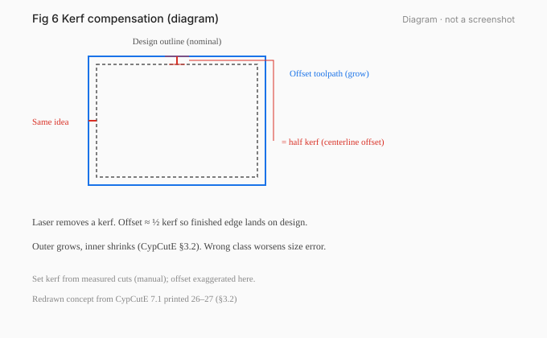
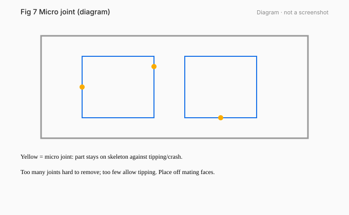
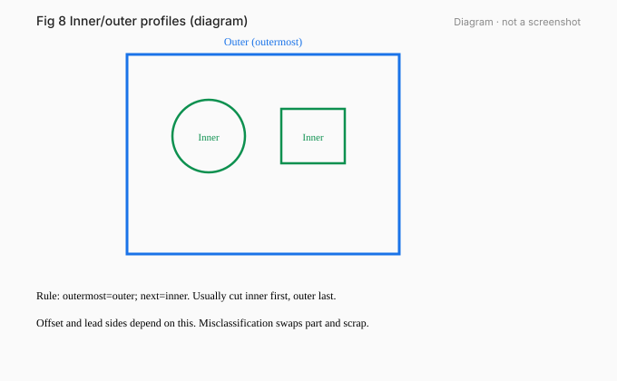
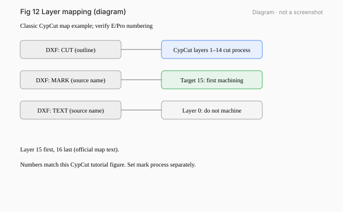

# 03 · Layers, Leads, Kerf, Micro Joints, and Cooling Points

[简体中文](../zh-CN/03-leads-kerf-microjoints.md) | [English](./03-leads-kerf-microjoints.md)

[Previous / Import Drawings and Check Dimensions](02-import-drawings.md) · [Next / Nesting, Sorting, and Simulation](04-nesting-sorting-simulate.md)

*Figures 03-1…03-5 diagrams, not screenshots.*

## What you will learn

Explain layer mapping, leads, kerf compensation, and the difference between **ordinary micro joints / seamless micro joints / cooling points**; finish process prep for the plate.

## Prerequisites and version scope

Chapter 02. CypCutE §3.1–3.4, §3.16 (based on 6.4.2310). CypCutPro §3.3 micro joint, §3.4 cooling point (PDF 44–45 / printed 31–32).

## 1. Layers: mapping semantics

Never say “a DXF layer name decides machining by itself”. Correct chain:

1. **DXF source layer** (any name: CUT / MARK / TEXT0).
2. After import, **DXF layer mapping** points to a **software target layer**.
3. Target layer attributes: can be “do not machine”; some builds use last two layers for first/last order.
4. **Layer parameters** hold cut/mark process settings. Names do not auto-assign process.

*Figure 03-6 exercise ex07: source layers CUT / MARK / TEXT0.*

## 2. Outer/inner profiles and leads

Classify by enclosure: outermost is outer profile, next inner, and so on. Open curves cannot form a profile layer.  
Outer (positive cut) leads enter from outside; inner (negative cut) leads enter from inside.  
Auto leads may overwrite placement; use lead check to avoid crossings.

## 3. Kerf compensation

- **Measure kerf from real cuts** (manual wording).
- The offset path is machined; the design outline is display only.
- Inner shrinks, outer grows (or set manually).
- Corner style: fillet or square.

*The short bridge in figure 03-2 marks design→toolpath offset ≈ ½ kerf, not a dimension callout.*

## 4. Micro joints vs cooling points (do not mix)

| Feature | Purpose | At that point | Source |
|---|---|---|---|
| **Ordinary micro joint** | Keep a tiny uncut link so the part **does not tip/warp** | **Laser off**; gas/follow per short rapid settings | CypCutPro §3.3 (PDF 44 / printed 31) |
| **Cooling point** | **Reduce corner burn** | Short dwell + laser off + **timed gas cool**, then resume | CypCutPro §3.4 (PDF 45 / printed 32) |
| **Seamless micro joint** | Cleaner break-away | **Reduced power** beam (not necessarily full off); root ratio adjustable | CypCutPro advanced parameters |

Notes:

- Do not generalize “laser off” to every micro-joint type.
- Cooling dwell is the “cooling point delay” gas default parameter.
- Micro joints split curves; you may need to explode before adding leads (E manual context).

## 5. Running case

1. Outer frame outer profile; two holes inner.  
2. Leads: into holes from inside; into frame from outside.  
3. Kerf: measured; inner shrink, outer grow.  
4. Micro joints: 1–2 on non-mating edges against tipping.  
5. For sharp corners that burn: add a **cooling point**, not a micro joint pretending to be one.  
6. Order: holes → outer.  
7. Simulate.

## Exercises

1. Which side for outer leads? Inner?
2. Where does kerf width come from?
3. Laser on/off at an ordinary micro joint? Why is a cooling point different?
4. Write the four-step layer chain.
5. Use ex01 for outer/inner and order.

## Answers and criteria

1. Outer from outside (positive); inner from inside (negative).
2. Measured from real cuts.
3. **Off**. Cooling points dwell, cool with gas, and protect corners — different purpose.
4. Source → map → target layer → layer process.
5. Holes first, outer last.

**Criteria**: three features not conflated; no “layer-name magic”.

## Common mistakes

- Writing cooling-point behavior into micro-joint definition.
- Treating kerf as scaling the drawing.
- Assuming TEXT0 never machines because of its name.

## Sources

- CypCutE §3.1–3.4, §3.16 (based on 6.4.2310)
- CypCutPro §3.3 / §3.4 / seamless micro joint (7.1.2432.5)
- exercises ex01, ex07

---

[Previous / Import Drawings and Check Dimensions](02-import-drawings.md) · [Next / Nesting, Sorting, and Simulation](04-nesting-sorting-simulate.md)

[简体中文](../zh-CN/03-leads-kerf-microjoints.md) | [English](./03-leads-kerf-microjoints.md)
