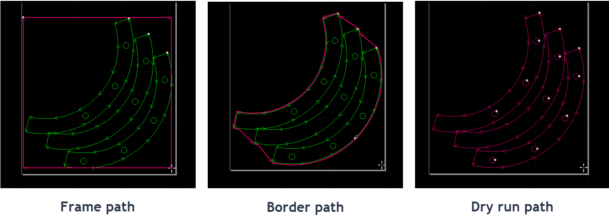

# 04 · Plan the cutting sequence

[简体中文](../zh-CN/04-nesting-sorting-simulate.md) · [English](./04-nesting-sorting-simulate.md)

Three closed profiles on screen do not guarantee the intended machining order. We will turn the two holes and the outside profile into an inspectable job, then apply the same method to a three-part layout.

## Complete the holes before the outside

Show machining order and check that both holes precede the outer profile. The order between the holes can depend on travel distance. For this exercise, establish the correct dependency before optimising cycle time.

The CypCutE manual distinguishes order within a layer from order between layers. If changing a hole’s sequence does not change final playback, inspect its target layer and layer order rather than repeatedly sorting the graphic.

A micro-jointed outer profile may contain several cutting segments and short moves. Check that both holes finish before the outer profile finishes; do not require exactly three displayed path segments.

## Inspect four things during simulation

1. **The first start:** the intended lead-in begins the job.
2. **Profile order:** both holes complete before the outer profile.
3. **Cutting versus travel:** moves between profiles are travel moves, and annotation is excluded.
4. **Completion:** intended profiles are processed without unintended repeats; deliberate retained sections match the joint settings.

Play slowly at first. Stop at a discrepancy and change the relevant layer or sequence. Save, reopen and simulate again to verify that the delivered file retains the settings.

## Nesting adds sheet constraints

[Ex08](../../exercises/dxf/ex08-multi-part-layout.dxf) contains three already-positioned parts with one hole each. SHEET is a 190 × 75 mm reference rectangle; NOTE is annotation.

Explicitly exclude SHEET and NOTE from machining and confirm that they do not play as cutting paths. Their names do not provide that behaviour automatically. The part extents are x=10–60, 75–125 and 140–190; the sheet is x=5–195. Nominal left/right margins are therefore 5 mm and part gaps are 15 mm. These are exercise dimensions, not production recommendations.

After adding leads and outward compensation, inspect actual toolpath clearance again. A nominal profile inside the border does not establish that its complete path fits. The real sheet, clamps, supports and required process margins must also be checked at the machine.

## What each check establishes

*Left to right: Frame, Border and Dry Run. Frame and Border do not traverse the complete machining sequence.*

| Function | What it checks | What it does not establish |
|---|---|---|
| Software simulation | File order and screen paths | Real sheet position, physical clearance or cut-through |
| Frame | Real travel around the bounding frame | Every internal path is clear |
| Border, where available | Outermost profile boundary | The complete job route |
| Dry Run | Real motion along the machining path; cited manual describes laser and gas off | First-part cutting quality |

Simulation completes the offline exercise. The real-motion checks need correct coordinates, sheet location and clearance first; see Chapters 6–7. Do not wait for the head to approach an obstruction before deciding whether the path is clear.

Simulation starts by cutting the SHEET rectangle. What should change?

Inspect source-to-target mapping and the target’s non-machining setting. Putting the frame last still leaves it in the cutting job. Re-run simulation after excluding it.

References: CypCutE V7.1 §§3.18, 4.5–4.6 and 5.1; [Bochu machining precheck](https://www.bochu.com/tutorials/basics-machining-precheck/).

---

[← Put the toolpath in the right place](03-leads-kerf-microjoints.md) · [Contents](README.md) · [Understand the machine’s operating conditions →](05-machine-and-prestart.md)
