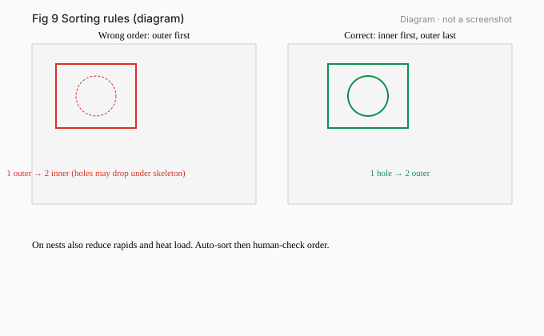
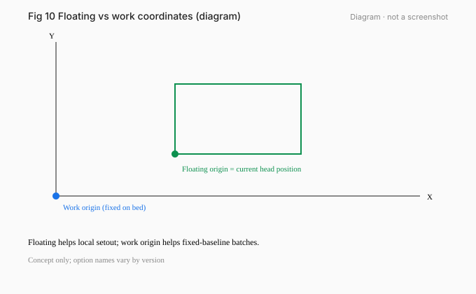
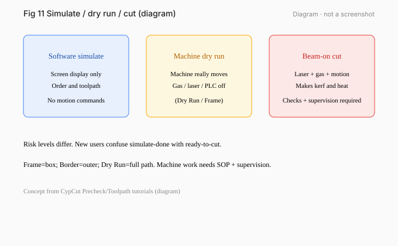

# 04 · Nesting, Sorting, and Simulation

[简体中文](../zh-CN/04-nesting-sorting-simulate.md) | [English](./04-nesting-sorting-simulate.md)

[Previous / Layers, Leads, Kerf, Micro Joints, and Cooling Points](03-leads-kerf-microjoints.md) · [Next / From Screen to Machine: Parts and Pre-Start Checks](05-machine-and-prestart.md)

*Figures 04-1…04-3 diagrams.*

## What you will learn

Prepare single- and multi-part paths, check inner/outer order and stock frame, and separate software simulation from real machine motion.

## Prerequisites and version scope

Chapter 03. CypCutE sorting / nesting / §5.1 simulation (can run without the machine); CypCut tutorial Toolpath Planning.

## 1. Sorting: inner first, outer last

- Cut holes/inner contours before outer outlines so parts do not drop early.
- Minimize rapids between parts.
- Groups can lock internal order.

*Figure 04-4 exercise ex08: three single-hole parts + closed SHEET frame.*

## 2. Nesting and reference frame

- Single proof: keep the part on stock with edge margin.
- Multi-part: common-line/micro joints per site process; **SHEET is not a cut path**.
- Map SHEET/NOTE to a non-machining target layer or exclude them and confirm in simulation.

## 3. Simulate vs dry run vs cut

| Action | Motion | Laser | Gas | Use |
|---|---|---|---|---|
| Software simulate | none (offline OK) | off | off | path and order |
| Dry Run | **moves** | off | off (manual wording) | real envelope / interference |
| Frame / border | moves | off (red pointer) | — | is the range on the plate? |
| Cut | moves | on | on | parts |

`Offline practice`: software simulate.  
`Supervised on machine`: dry run, frame, cutting.

## 4. Checklist

1. Inner before outer.  
2. Frame/notes excluded.  
3. Rapids/fixture risk.  
4. Simulated part count matches.  
5. Running case: 2 holes + 1 outer = 3 contour paths.

## Exercises

1. How many parts and holes in ex08? What is SHEET?
2. Differences among simulate / dry run / cut.
3. A sensible order for ex08.
4. Why does the name NOTE not auto-disable machining?

## Answers and criteria

1. Three parts, one hole each; SHEET is a 190×75 closed stock reference.
2. See the table.
3. Example: each hole → each outer; parts 1→2→3.
4. Source names must be mapped to target layers with attributes/process.

**Criteria**: inner-first order; SHEET ≠ CUT; simulation does not fire the laser.

## Common mistakes

- Cutting outer first so the part drops.
- Treating SHEET as a cut line.
- Using simulation instead of real dry-run safety checks.

## Sources

- CypCutE sorting/nesting/simulate (based on 6.4.2310)
- CypCut tutorials Toolpath Planning / Machining Precheck
- exercises ex06, ex08

---

[Previous / Layers, Leads, Kerf, Micro Joints, and Cooling Points](03-leads-kerf-microjoints.md) · [Next / From Screen to Machine: Parts and Pre-Start Checks](05-machine-and-prestart.md)

[简体中文](../zh-CN/04-nesting-sorting-simulate.md) | [English](./04-nesting-sorting-simulate.md)
