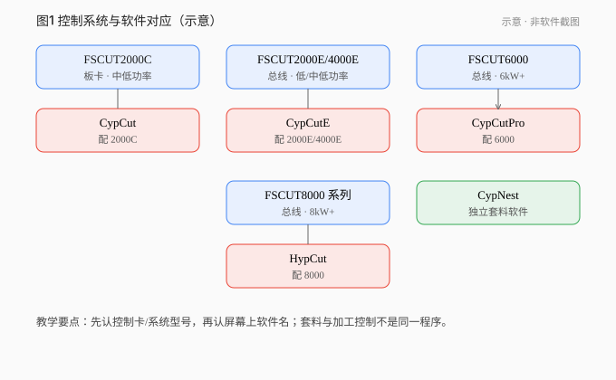

# 01 · 认识柏楚系统、软件和文件

[简体中文](./01-bochu-systems.md) | [English](../en/01-bochu-systems.md)

[上一章 / 开始之前：学习路线与练习环境](00-start-here.md) · [下一章 / 导入图纸与检查尺寸](02-import-drawings.md)

*图 01-1 示意：控制系统在机床侧，加工软件在工控机。非软件截图。*

## 学会什么

分清控制系统型号、加工软件、套料软件、文档版本与运行版本，并知道离线能练什么。

## 前置与适用版本

概念通用。手册基准：CypCutE V7.1（基于软件 **6.4.2310**）；CypCutPro 文档 V1.0.0（基于软件 **7.1.2432.5**）。运行版本未实测。

## 1. 先认硬件系统，再认软件

控制系统型号（FSCUT…）装在机床侧；切割软件跑在工控机上，二者配套。

| 控制系统 | 产品线定位（非选型唯一依据） | 配套软件 |
|---|---|---|
| FSCUT2000C | 中低功率板卡 | CypCut |
| FSCUT2000E | 总线 1–4 kW | CypCutE |
| FSCUT4000E | 总线 1.5–8 kW | CypCutE |
| FSCUT6000 | 总线较高功率段 | CypCutPro |
| FSCUT8000 系列 | 总线更高功率段 | HypCut |

**CypNest** 是独立套料软件，不做出光控制。

> 功率定位是产品线描述，不能单独决定现场软件或工艺参数。

## 2. 三种版本字段必须分开

1. **文档版本**（封面）：例如手册「版本：7.1」。
2. **手册声明的适用软件版本**：例如前言「本文档基于 … 6.4.2310」。
3. **运行版本**：练习机「关于」页——本教程未安装实测。

禁止把「手册 7.1」当成软件运行版本写进步骤。

## 3. 离线能学什么

| 软件（手册所载） | 无硬件时 | 说明 |
|---|---|---|
| CypCut（含 Dog 表述的手册） | 无 Dog → DEMO | 除加工控制外可用 |
| CypCutE 基于 6.4.2310 | 无控制卡 → 演示模式 | 可装独立笔记本做设计 |
| CypCutPro 基于 7.1.x | 无控制卡 → 演示模式 | 同上 |
| HypCut | 须对应硬件；未见演示表述 | 待核实 |

`可离线练习`：导入、单位尺寸、优化、引线/补偿/微连、图层映射、排样排序、**软件模拟**、存任务。  
`需带教上机`：回原点、寻边、走边框安全、出光首件。

## 4. 常见文件类型

| 类型 | 用途 |
|---|---|
| DXF 等 | 几何图形 |
| *.lxd / *.lxds | 刀路 |
| *.nrp / *.nrp2 | 套料包 |
| *.fsm | 材料/图层工艺（可能 OEM 限制） |
| 任务文件（如 *.cps） | 保存零点、寻边角、断点，便于插单恢复 |

## 5. 界面分区（CypCutE 手册语境）

中央绘图板 + 机床幅面白框；菜单含文件/常用/绘图/排样/数控/视图；右侧工艺区含多图层色钮，可设「不加工」；最后两个图层可对应最先/最后加工（以你软件手册与界面为准）。

## 6. 案例

展台铭牌若控制系统是 FSCUT4000E → 对照上表用 CypCutE → 打开「关于」记运行版本 → 用演示模式准备图形 → 笔记页眉写清「手册文档版本 / 基于软件版本 / 运行版本」。

## 练习

1. FSCUT6000 对应哪款加工软件？套料用什么？
2. 写出文档版本 / 基于软件版本 / 运行版本三行（运行可写未测）。
3. 各列 3 项离线与上机内容。

## 答案与评价

1. CypCutPro；CypNest。
2. 示例：文档 V7.1 / 基于 CypCutE 6.4.2310 / 运行未测。
3. 离线：导入、引线、模拟。上机：回原点、寻边、出光。

**评价**：系统与软件对应正确；版本三分正确；不说演示模式能加工。

## 常见错误

- 无 Dog 规则套到 E/Pro（它们手册写的是无**控制卡**）。
- 把 CypNest 当成能出光的控制软件。

## 来源

- CypCutE 用户手册 V7.1（基于 6.4.2310）：欢迎页、§1.2、§1.3.2
- CypCutPro 用户手册 V1.0.0 前言（软件 7.1.2432.5）
- CypCut / HypCut / CypNest 产品与手册公开说明（见 `version-scope.md`）

---

[上一章 / 开始之前：学习路线与练习环境](00-start-here.md) · [下一章 / 导入图纸与检查尺寸](02-import-drawings.md)

[简体中文](./01-bochu-systems.md) | [English](../en/01-bochu-systems.md)
