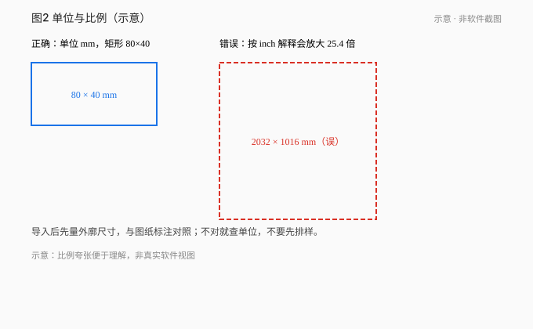
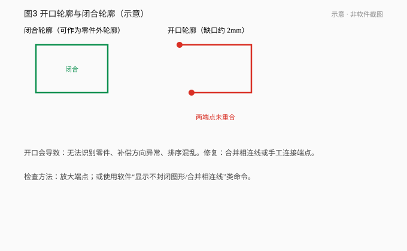
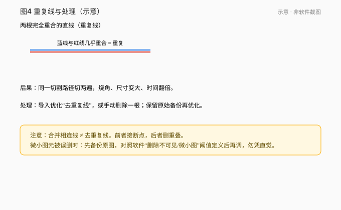
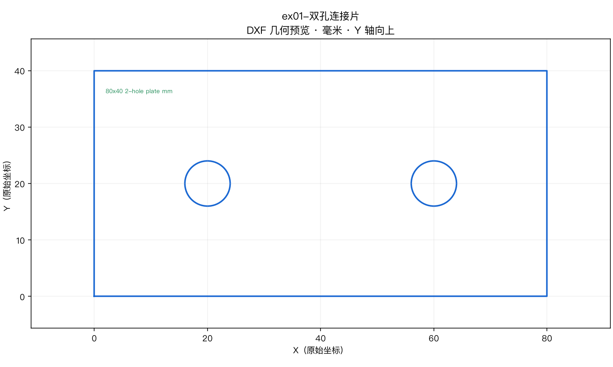

# 02 · 导入图纸与检查尺寸

[简体中文](./02-import-drawings.md) | [English](../en/02-import-drawings.md)

[上一章 / 认识柏楚系统、软件和文件](01-bochu-systems.md) · [下一章 / 图层、引线、补偿、微连与冷却点](03-leads-kerf-microjoints.md)

*图 02-1～02-3 示意。*

## 学会什么

导入 DXF 后检查单位、开口、重复线、小图元，并整理可加工的练习图纸。

## 前置与适用版本

第 01 章。手册语境：CypCutE §1.4 导入与优化；CypCut 英文教程 Optimize Drawing。

## 1. 导入后先量尺寸

1. 导入图纸。
2. **立刻用软件量尺**量一个已知边（例如连接片长边应约 80 mm）。
3. 核对图纸单位（DXF `$INSUNITS` 或导入对话框单位）。

若显示约 2032 mm，多半是把毫米几何按英寸解释（×25.4）。处理：在单位/缩放中改为 mm 解释并再量；**保留原文件**。

## 2. 检查开口与闭合

- 外轮廓、内孔应闭合才能成为一层外模/内模。
- 用软件的开放轮廓检查，或观察未连接端点。
- 缺口要**画线闭合或延伸**，不要靠补偿“猜”上。

*图 02-4 练习 ex04：左下缺口示意预览（由 DXF 几何绘制）。*

## 3. 重复线与极小图元

- 共线重复段会被切多遍。用去重复线/手动删除，直到每段几何只保留一份。
- 极小图元可能被“删除极小图形”类优化掉。`可离线练习`：备份 → 查看阈值与单位 → 对照导入结果并记录。阈值是否合适**待对应机器验证**，不要一刀切调大。

*图 02-5 练习 ex03：底边重复线。*

## 4. 优化动作清单（做什么 → 在哪里 → 看到什么）

| 做什么 | 在哪里（CypCutE 语境） | 应该看到 |
|---|---|---|
| 去重复线 | 优化/清理工具 | 底边等共线段减少到 1 份 |
| 合并相连线 | 同上 | 开口端点减少 |
| 删除极小图形 | 同上，先读阈值 | 微段消失或保留（记结果） |
| 区分内外模 | 图形工艺 | 外框与孔识别为外/内模 |

按钮名随版本变化，以你软件界面为准。

## 5. 贯穿案例：双孔连接片

*图 02-6 练习 ex01：80×40 外框 + 两孔（示意预览）。*

导入 ex01 → 量长边 80、宽 40 → 确认两孔为内轮廓 → 外框闭合。

## 练习

1. 下载 `exercises/dxf/ex02-wrong-units.dxf`，说出导入后异常尺寸与处理思路。
2. 用 ex03 指出重复线位置。
3. 用 ex04 报出缺口端点（两个坐标）。
4. 用 ex05 记录微小图元实验（3 行或标待验证）。

## 答案与评价

1. `$INSUNITS=inch` 但几何按 mm 画；按 inch 解释约放大 25.4 倍。改为 mm 解释并量尺。
2. 底边 (0,0)–(60,0) 与 LINE 共线重复。
3. 端点 **(0,0) 与 (0,2)**，缺口在**左下**，缺 (0,0)→(0,2) 约 2 单位。
4. 见 `exercises/answers/zh-CN/ex05-tiny-entities.md`。

**评价**：先量尺寸；能报出端点；不把“删除极小”当成必然唯一解。

## 常见错误

- 不量尺寸就开始改补偿。
- 把开口轮廓靠补偿方向“补上”。
- 故意的教学错误文件当成损坏文件删掉。

## 来源

- CypCutE 用户手册导入/优化相关章节（基于 6.4.2310）
- CypCut 英文教程 Optimize Drawing
- 练习几何：`exercises/dxf-structure-report.json`

---

[上一章 / 认识柏楚系统、软件和文件](01-bochu-systems.md) · [下一章 / 图层、引线、补偿、微连与冷却点](03-leads-kerf-microjoints.md)

[简体中文](./02-import-drawings.md) | [English](../en/02-import-drawings.md)
