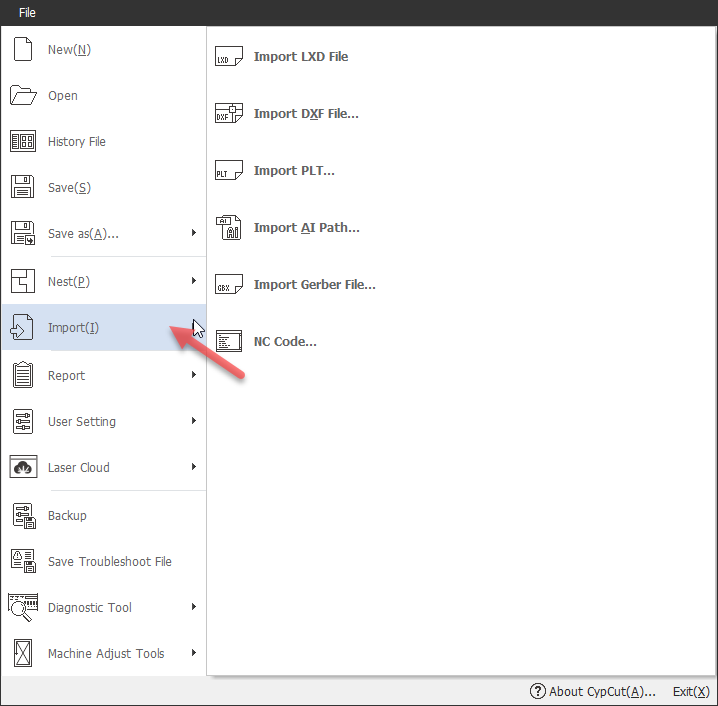
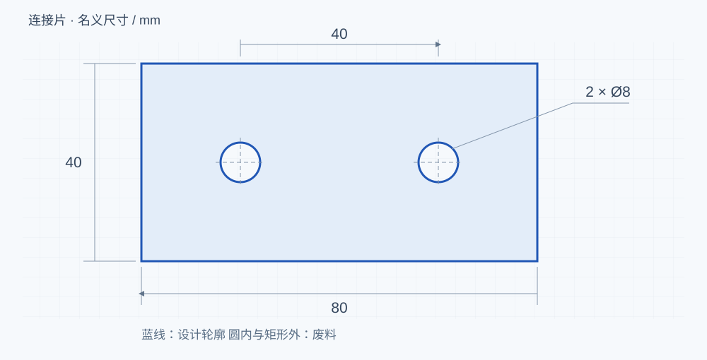
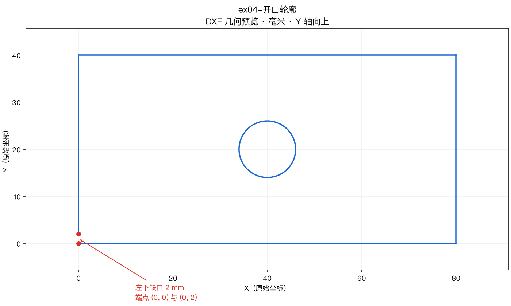

# 02 · 把图纸检查干净

[简体中文](./02-import-drawings.md) · [English](../en/02-import-drawings.md)

这一章先不调气压、功率或补偿。目标很具体：确认图里的零件正是你准备加工的零件。用[双孔连接片](../../exercises/dxf/ex01-double-hole-plate.dxf)练习，原文件保留一份，另建工作副本。

## 1. 从空白文档读入图形

经典 CypCut 官方教程使用“文件 → 导入”（File → Import）追加图形；首次练习也可以用“打开”载入一份文件。不要在已有连接片的画面中再次导入同一份。

*看图中的左侧 File 菜单和 Import 行。它解决的是“把文件读进来”，不是“文件已经检查合格”。*

导入后先缩放到全部图形，寻找一个矩形、两个圆，以及说明文字。ex01 中说明文字位于 MARK 源层；本次练习只切轮廓，下一章会把说明层明确排除。若看不到图形，先确认是否成功载入，再使用适合全部图形的视图，不要立即重复导入。

## 2. 测一个长度，再测一个孔

在当前版本的测量工具中选择距离测量，捕捉矩形长边的两个端点。应该得到 80 mm；短边应为 40 mm。然后读取圆的尺寸属性，确认直径为 8 mm，或半径为 4 mm。不要把半径栏里的 4 当成孔径。

两孔圆心分别在 (20,20) 与 (60,20)，所以中心距是 40 mm。这些坐标只描述图形自身，还不是机床上的位置。

试着再打开[单位错误练习 ex02](../../exercises/dxf/ex02-wrong-units.dxf)。文件的几何坐标仍是 80 × 40，但单位声明是英寸。导入器如果按该声明换算到毫米，就会得到 2032 × 1016；如果当前软件忽略了声明，画面也可能仍是 80 × 40。因此，练习的重点是量尺寸并记录实际行为，不是必须看到一次放大。

确认本来就是毫米图之后，优先用导入单位重新解释；只能缩放时，按实际测量的比例更正。若软件已经显示 80 × 40，再乘或除 25.4 就会把正确图形改错。单位问题处理完再做引线和补偿，以免之后又要重做。

## 3. 找到没有接上的端点

打开[ex04](../../exercises/dxf/ex04-open-contour.dxf)。它看起来几乎是矩形，左下方却缺了一小段。

放大左下角：竖线止于 (0,2)，底边止于 (0,0)，两点之间相差 2 mm。使用对应版本的“不封闭图形”选择或显示功能找到轮廓，再用绘图工具补上这段，或在确认设计意图后延伸到交点。最后重新检查闭合，不能因为两条线在缩小视图里挨得很近就认为已连接。

合并相连线是否能跨过这个缺口，要看它的容差。把容差随意放大，可能把本来应该分开的细节也连起来。这里直接修复已知缺口，更容易理解和核查。

## 4. 一条可见的线，可能有三份实体

[ex03](../../exercises/dxf/ex03-duplicate-lines.dxf) 的底边包含闭合外框的一条边，以及另外两条重合 LINE。画面上看着只是一条，未经处理的路径却可能重复。

执行去重复线前保留副本，执行后检查底边只剩一份有效路径，再看模拟有无重复经过。不要把“合并相连线”和“去重复线”当成同一个工具：前者处理连接关系，后者处理重叠实体。

[ex05](../../exercises/dxf/ex05-tiny-entities.dxf) 则包含长度 0.05 mm 的线和半径 0.03 mm 的圆。用它观察“去除极小图形”的阈值与结果。真实零件上的小孔也可能是设计要求，自动优化不能替代判断。

## 留下一份检查结果

| 检查 | ex01 应有结果 |
|---|---|
| 外形 | 80 × 40 mm |
| 孔 | 两个，直径 8 mm |
| 中心距 | 40 mm |
| 外框与孔 | 闭合，位置符合图纸 |
| 重复与杂点 | 不存在不需要的加工实体 |
| 说明文字 | 已识别，待在目标层排除加工 |

保存为新的加工副本。下一章只在这份尺寸正确的图上加工艺。

练习核对：2032、4 和 2 分别说明什么？

2032 mm 可能是 80 英寸换算的结果；4 mm 是 ex01 的圆半径，孔径为 8 mm；2 mm 是 ex04 的已知缺口长度。先确认这些值对应的对象与单位，再决定改哪一项。

依据：CypCutE V7.1 §1.4.2；[导入教程](https://www.bochu.com/tutorials/basics-import-drawing/)；练习 DXF 原始几何。

---

[← 认清软件，找到工作区](01-bochu-systems.md) · [目录](README.md) · [让刀路落在正确的位置 →](03-leads-kerf-microjoints.md)
