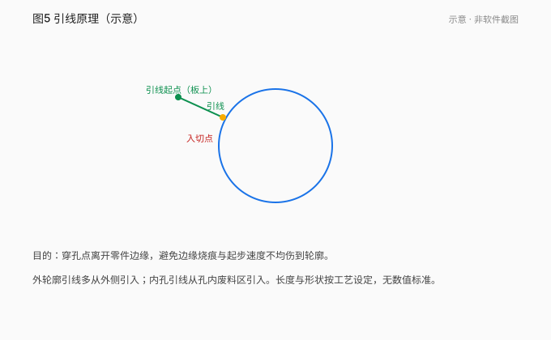
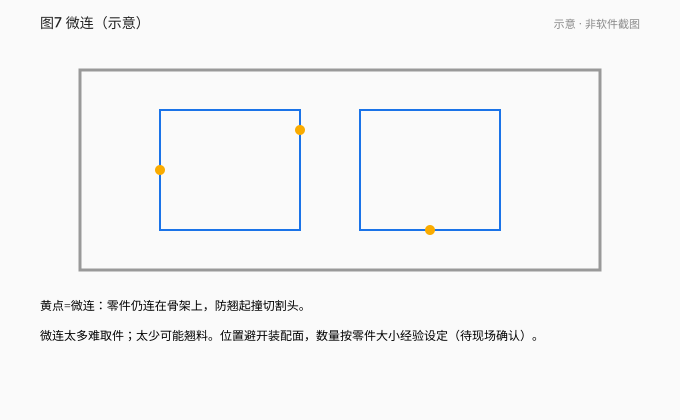
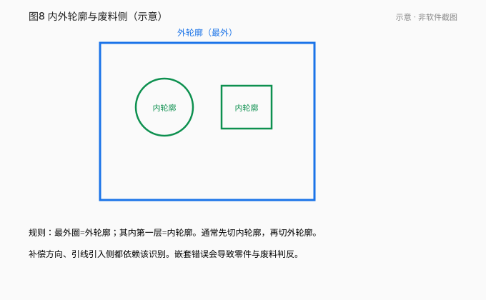
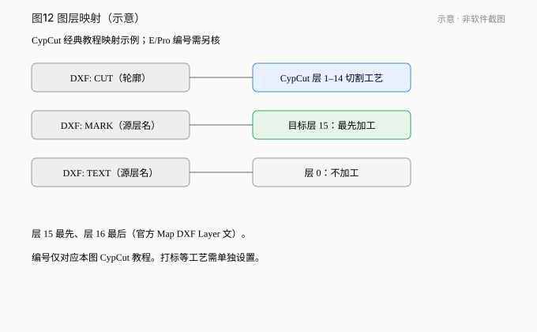
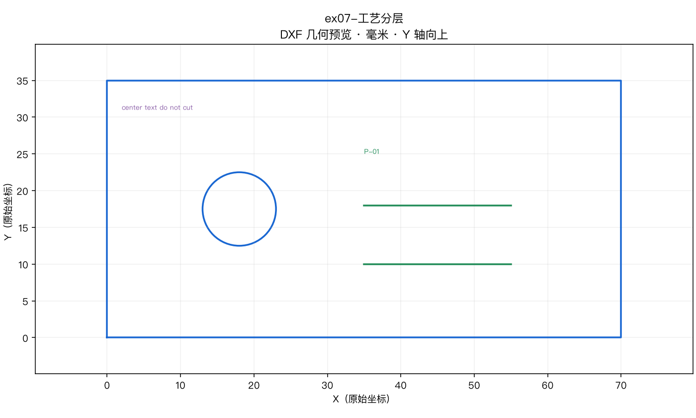

# 03 · 图层、引线、补偿、微连与冷却点

[简体中文](./03-leads-kerf-microjoints.md) | [English](../en/03-leads-kerf-microjoints.md)

[上一章 / 导入图纸与检查尺寸](02-import-drawings.md) · [下一章 / 排样、排序与模拟](04-nesting-sorting-simulate.md)

*图 03-1～03-5 示意，非软件截图。*

## 学会什么

解释图层映射、引线、割缝补偿、**普通微连 / 无痕微连 / 冷却点**的区别，并完成连接片的工艺准备。

## 前置与适用版本

第 02 章。CypCutE 手册基于 6.4.2310 §3.1–3.4、§3.16；CypCutPro 手册软件 7.1.2432.5 §3.3 微连、§3.4 冷却点（PDF 44–45 / 印刷 31–32）。

## 1. 图层：映射语义

**不要**说「DXF 层名天生决定是否加工」。正确链路：

1. **DXF 源图层**（名字任意，如 CUT / MARK / TEXT0）。
2. 导入后 **DXF 图层映射** 指到软件**目标图层**。
3. 目标层属性：可设「不加工」；有的版本最后两个图层=最先/最后加工。
4. **图层参数**设置切割/打标等工艺。层名不会自动配工艺。

*图 03-6 练习 ex07：CUT / MARK / TEXT0 源图层。*

## 2. 内外模与引线

按**包围关系**分层：最外为外模，下一层内模……不封闭图形不能构成一层。  
外模阳切从外部引入；内模阴切从内部引入。  
引线类型常见圆弧、直线；自动引入会覆盖原位置，可用「检查引入引出」避免交叉。

## 3. 割缝补偿

- **割缝宽度应根据实际切割结果测量获得**（手册表述）。
- 补偿后轨迹才被加工；原图仅显示。
- 方向：内模内缩、外模外扩（可手选）。
- 拐角可用圆角/直角过渡。

*图 03-2 的短跨接表示「设计轮廓 → 刀路」偏置约 1/2 割缝，不是尺寸标注。*

## 4. 微连与冷却点（必须分清）

| 功能 | 用途 | 加工到该点时 | 来源 |
|---|---|---|---|
| **普通微连** | 插入不切割小段，**避免零件翘起** | **关闭激光**；是否关气/跟随由短距离空移参数决定 | CypCutPro §3.3（PDF 44 / 印刷 31） |
| **冷却点** | **拐角防烧角** | 短暂停留 + 关光，并按全局参数**延时吹气**，再开光 | CypCutPro §3.4（PDF 45 / 印刷 32） |
| **无痕微连** | 微连处更好下料/减痕 | 以**较小功率出光**（并非必然全关光），可调留根比例 | CypCutPro 高级参数表 |

要点：

- 普通微连的“关光”**不能**写成所有微连类型的一致行为。
- 冷却点延时在气体默认参数里叫「冷却点延时」。
- 微连会把图形分成几段；要加引线可能需先炸开微连（E 手册语境）。

## 5. 贯穿案例：双孔连接片

1. 外框外模，两孔内模。  
2. 引线：孔内引、框外引。  
3. 补偿：实测割缝；内缩外扩。  
4. 微连：在非配合边加 1–2 个，防翘。  
5. 若尖角易烧：在尖角加**冷却点**，不要误加微连充当冷却。  
6. 顺序：两孔 → 外框。  
7. 模拟检查。

## 练习

1. 外模引线从哪侧？内模呢？
2. 割缝宽度从哪里来？
3. 普通微连处激光开还是关？冷却点为什么不是微连？
4. 写出图层四步链路。
5. 用 ex01 说明内外模与顺序。

## 答案与评价

1. 外模外引入（阳切）；内模内引入（阴切）。
2. **实际切割结果测量**。
3. 普通微连处**关**激光。冷却点用于拐角停留+关光+延时吹气防烧角，目的不同。
4. 源层 → 映射 → 目标层 → 图层工艺。
5. 两孔内模先，外框外模后。

**评价**：三概念不混用；图层链路正确；不写“层名魔法”。

## 常见错误

- 把冷却点步骤写进微连定义。
- 补偿当成放大图纸。
- 认为名叫 TEXT0 就会不加工。

## 来源

- CypCutE 手册 §3.1–3.4、§3.16（基于 6.4.2310）
- CypCutPro 手册 §3.3 / §3.4 / 无痕微连（软件 7.1.2432.5）
- 练习 ex01、ex07

---

[上一章 / 导入图纸与检查尺寸](02-import-drawings.md) · [下一章 / 排样、排序与模拟](04-nesting-sorting-simulate.md)

[简体中文](./03-leads-kerf-microjoints.md) | [English](../en/03-leads-kerf-microjoints.md)
