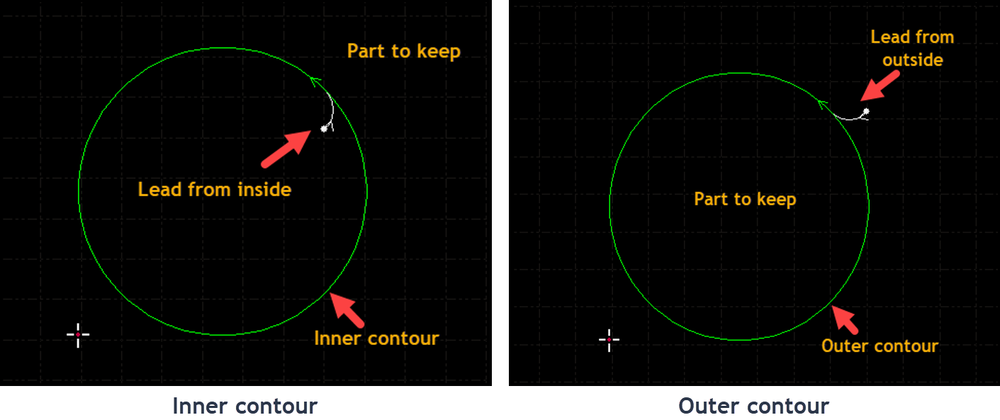
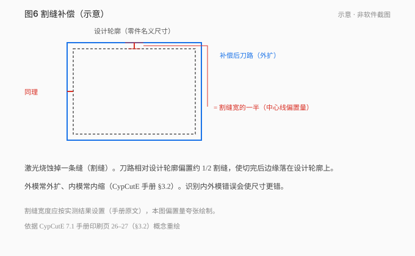

# 03 · 让刀路落在正确的位置

[简体中文](./03-leads-kerf-microjoints.md) · [English](../en/03-leads-kerf-microjoints.md)

图纸尺寸已经正确，现在要告诉软件：哪些线参与加工，从哪里进入轮廓，刀路偏向哪一侧。继续使用上章保存的双孔连接片。

## 先让说明文字退出切割

ex01 的 CUT 层包含矩形和两孔，MARK 层包含说明文字。这里的名称来自 DXF；叫 MARK 并不会自动变成打标，也不会自动不加工。

在对应版本的“DXF 图层映射”中，把 CUT 指向本次使用的加工目标层，把说明文字指向不加工目标层，或从加工副本中明确排除。然后打开目标层参数核对行为。不要只改图形颜色，就认为工艺已经改变。

*这张官方图帮助你辨认图层与参数窗口。图中速度、功率和气压不属于本练习工艺，不能据图照抄。*

对照[分层练习 ex07](../../exercises/dxf/ex07-layer-process.dxf)再想一次：如果以后确实要标 P-01，应该为那组几何选择并设置打标工艺；只在文档里当说明的文字则不参与加工。文字能否直接导入或需转换成轮廓，另按当前软件核对。

## 引线为什么要在废料里

穿孔是从完整板面建立切口，局部受热和喷溅与稳定切割不同。若把穿孔点直接放在成品边界上，就可能在需要保留的边缘留下痕迹。引线让切割先在废料区开始，再接入零件轮廓。

*官方图左边保留圆外材料，所以从圆内进入；右边保留圆内零件，所以从圆外进入。先判断保留哪一侧，再决定引线。*

对连接片分别选中两孔，使用引线功能，检查穿孔起点位于圆内。再选外框，让穿孔起点处在矩形外侧。放大看引线是否碰到相邻轮廓；“自动引线”并不免除这一步检查。

离线练习先观察位置和方向，长度只在练习副本中用于比较形状。真正加工的引线长度与穿孔条件、材料厚度有关，应从该机验证过的工艺开始，不把软件默认长度当成批准参数。

## 补偿是在移动刀路

设想一个仅用于算几何的例子：名义宽度 80 mm，假设切缝宽度为 0.20 mm。若刀路中心沿设计边界走，左右两边各损失半条缝，外形约剩 79.80 mm；将两侧刀路各向外偏 0.10 mm，才有机会把实际边缘放回设计边界。

同样的理想模型中，直径 8 mm 的孔若沿圆线切，开口约为 8.20 mm，所以圆的刀路应向内偏。这只是帮助你理解方向的几何计算，0.20 mm 不是本机的推荐割缝。

在对应版本补偿功能中，检查它要求输入的是割缝宽度还是偏置量，再按定义填写。沿实际测得的割缝建立加工参数，不要因为图中“偏半条缝”就擅自将输入值除以二。

补偿后，检查外框刀路在外、孔刀路在内。再确认没有在 CAD 与切割软件里各补一次。缩放整个图纸会连孔距一起改变，不能替代补偿。

## 微连保留连接，冷却点安排停留

零件完全切开后可能翘起或失去支撑。普通微连故意保留一小段材料，将零件与周围材料连着。冷却点则在指定位置关光并按设置延时吹气，用来处理局部热积累。二者都可能短时关光，目的与路径处理却不同。

| 功能 | 完成后你想得到什么 | 应检查什么 |
|---|---|---|
| 普通微连 | 仍有一小段连接材料 | 位置是否影响配合边，长度是否适合该工艺 |
| 冷却点 | 经过该点后继续切完整轮廓 | 是否确有角部热问题，延时依据是什么 |
| 无痕微连 | 用特定留根工艺方便下料 | Pro 对应功能与留根设置，不能按全关光理解 |

在练习副本外框的一段非配合直边添加一处普通微连，放大查看标记，再删除它，比较路径变化。之后可以单独演示冷却点的标记。第一次连接片不需要把所有可选工艺都加上；真实工件是否在孔上加微连，也取决于孔废料和支撑情况，不能写成绝对“孔上不许加”。

## 这一章的结果

保存两份：一份保留已检查的几何，一份保留图层与工艺准备。重新打开加工副本，依次检查文字不加工、孔内引入、框外引入、补偿方向以及微连标记。

如果外形偏小、孔偏大，能不能把整张图放大？

不能直接这样处理。放大会改变孔心间距等设计尺寸，却不能同时修正外轮廓和孔的相反误差。先确认导入尺寸正确，再检查是否缺少补偿、方向是否正确，以及实际割缝依据。

依据：CypCutE V7.1 §3.1–3.4、§3.16；CypCutPro V1.0.0 §3.3–3.4、表 5-2；[官方工艺教程](https://www.bochu.com/tutorials/basics-technique-setting/)。

---

[← 把图纸检查干净](02-import-drawings.md) · [目录](README.md) · [把一件零件排成加工顺序 →](04-nesting-sorting-simulate.md)
