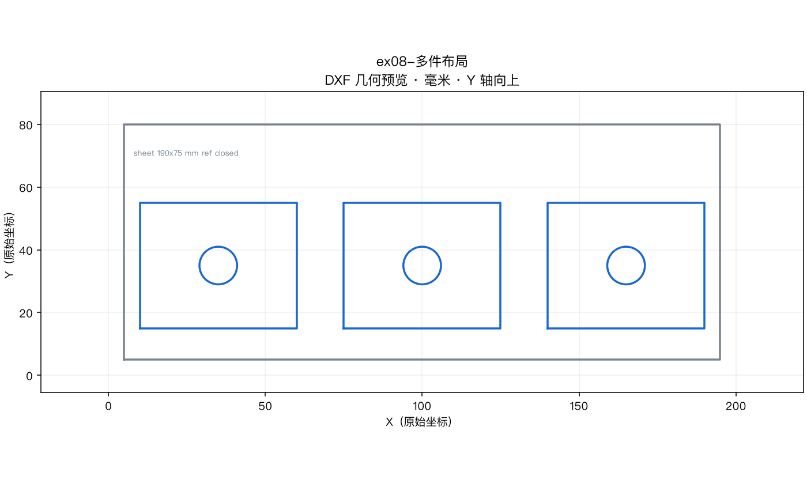

# 04 · 把一件零件排成加工顺序

[简体中文](./04-nesting-sorting-simulate.md) · [English](../en/04-nesting-sorting-simulate.md)

屏幕上有三条闭合轮廓，还不意味着它们会按你想的顺序加工。这一章把两孔和外框变成一次可检查的作业，再把同样的方法用到多件布局。

## 先切孔，后完成外框

打开加工次序显示，确认两个孔在外框之前。两孔之间通常可以按空移距离选择先后；这一练习不追求最短节拍，先保证轮廓依赖关系正确。

CypCutE 手册描述：图形次序在所属图层内调整，图层之间还受图层加工次序影响。如果你拖动孔的次序却发现最终播放没有变化，回到目标层检查，不要只在图形排序工具里反复调整。

有微连时，一个外框可能由多个切割段和短空移构成。检查的是“两个孔先完成、外轮廓最后完成”，不能死数屏幕上恰好只有三段路径。

## 播放模拟时看四个地方

1. **第一个出发点**：是否落在预期的第一处引线起点。
2. **轮廓顺序**：两个孔都完成之后才处理外框。
3. **切割与空移**：孔间、孔到外框之间的连接是空移，说明文字没有进入加工路径。
4. **结束状态**：所有应加工的轮廓都经过一次，微连等有意保留的位置符合设置。

先慢速播放，发现问题时停在那一步，回去改对应的图层或顺序。保存后重新打开并再播一次，确认最终交付的文件保留了这些设置。

## 排样增加的是板材约束

[ex08](../../exercises/dxf/ex08-multi-part-layout.dxf) 已经放好三件零件，每件一个孔。SHEET 是 190 × 75 mm 的板材参考框，NOTE 是说明文字。

先把 SHEET/NOTE 明确设为不加工，再检查它们没有出现在切割播放中。源层名本身不会阻止加工。各零件的外形位于 x=10–60、75–125、140–190，板框为 x=5–195，因此左右静态图形边距都是 5 mm，零件之间的图形间隔都是 15 mm。这些是练习几何，不是工艺推荐值。

加上引线和外扩补偿后，再看实际刀路到板边、到邻件的距离。只检查名义轮廓没有越界还不够。板材实际可用范围、夹具、支撑与工艺留边也要在机器上核对。

## 模拟、走边框、空走分别验证什么

*官方图从左到右是 Frame、Border、Dry Run。前两者并不是完整加工顺序。*

| 功能 | 它检查什么 | 它不能证明什么 |
|---|---|---|
| 软件模拟 | 文件顺序与屏幕路径 | 板材实际位置、夹具净空、是否切透 |
| 走边框 / Frame | 真实运动范围与外接边框 | 所有孔和内部路径都安全 |
| Border（对应版本） | 最外轮廓的边界 | 完整加工路线 |
| 空走 / Dry Run | 真实机床沿加工路径运动；所引手册中不开激光和气体 | 首件切割质量 |

电脑上练到模拟即可完成这一章。到机器上执行后几项时，要先具备正确坐标、板材位置和运动条件；相关步骤在第 6–7 章。不要等切割头已经接近障碍才用空走判断有没有碰撞。

模拟先播出了 SHEET 大矩形，应该改哪里？

检查 SHEET 源层的目标映射以及目标层的“不加工”设置。不要简单把板框排到最后；排到最后仍然会加工。更改后重新播放，确认板框不进入切割序列。

依据：CypCutE V7.1 §3.18、§4.5–4.6、§5.1；[官方加工前检查](https://www.bochu.com/tutorials/basics-machining-precheck/)。

---

[← 让刀路落在正确的位置](03-leads-kerf-microjoints.md) · [目录](README.md) · [认识机器的操作条件 →](05-machine-and-prestart.md)
