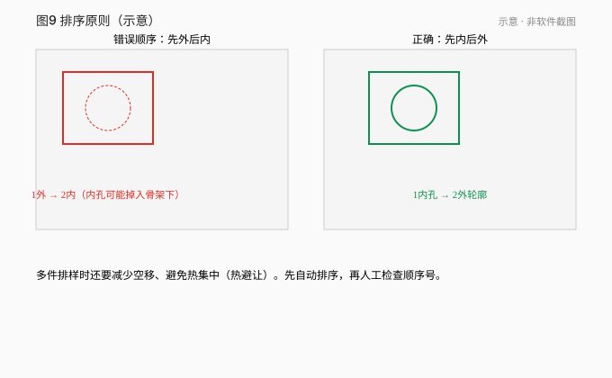
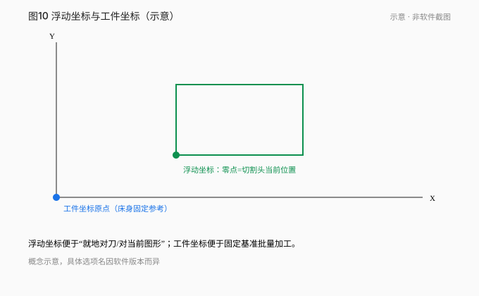
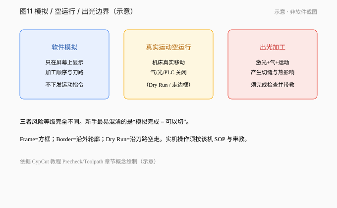

# 04 · 排样、排序与模拟

[简体中文](./04-nesting-sorting-simulate.md) | [English](../en/04-nesting-sorting-simulate.md)

[上一章 / 图层、引线、补偿、微连与冷却点](03-leads-kerf-microjoints.md) · [下一章 / 从屏幕走到机器：部件与开机前检查](05-machine-and-prestart.md)

*图 04-1～04-3 示意。*

## 学会什么

准备单件与多件路径，检查内外顺序与参考框，分清软件模拟与机床真实运动。

## 前置与适用版本

第 03 章。CypCutE §3.7 排序、§3.17 排样、§5.1 模拟（可脱离机床）；CypCut 英文教程 Toolpath Planning。

## 1. 排序原则（先内后外）

- 先内孔/内轮廓，后外轮廓，便于零件不提前掉、少变形。
- 件与件之间减少空移；小件可先切。
- 群组可锁定组内顺序。

*图 04-4 练习 ex08：3 件单孔 + 闭合 SHEET 板框。*

## 2. 排样与参考框

- 单件打样：确认零件在板内、留边距。
- 多件：共边/微连按现场工艺决定；**参考板框（SHEET）不进入切割**。
- SHEET、NOTE 等辅助层必须映射到不加工目标层或明确排除，并在模拟中确认不进刀路。

## 3. 模拟 vs 空走 vs 出光

| 动作 | 机床 | 激光 | 气体 | 用途 |
|---|---|---|---|---|
| 软件模拟 | 不动（可脱机） | 关 | 关 | 看路径与顺序 |
| 空走 Dry Run | **动** | 关 | 关（手册：不开激光不开气） | 看真实运动范围 |
| 走边框 Frame | 动 | 关（配红光） | — | 看加工范围是否在板内 |
| 加工 | 动 | 开 | 开 | 出光切零件 |

`可离线练习`：软件模拟。  
`需带教上机`：空走、走边框、加工。

## 4. 检查清单

1. 内外顺序是否内先外后。  
2. 板框/说明是否已排除。  
3. 空移是否穿模、撞夹具风险。  
4. 模拟结果是否与预期零件数一致。  
5. 贯穿案例：2 孔 + 1 外框，共 3 条轮廓路径。

## 练习

1. ex08 有几件、每件几孔？SHEET 是什么？
2. 写出模拟 / 空走 / 加工 三点差异。
3. 为 ex08 列一个合理切割顺序。
4. 为什么层名 NOTE 不能自动不加工？

## 答案与评价

1. 3 件，每件 1 孔；SHEET 为 190×75 闭合板材参考框。
2. 见上表：机床是否动、是否出光出气。
3. 示例：各件内孔 → 各件外框；件序 1→2→3 减少空移。
4. 层名只是 DXF 源名，须映射目标层并设属性/工艺。

**评价**：顺序含内先外后；能区分 SHEET 与 CUT；不说模拟会出光。

## 常见错误

- 先切外框导致零件掉落。
- 把 SHEET 当切割线。
- 用模拟代替真实空走安全确认。

## 来源

- CypCutE 手册排序/排样/模拟章节（基于 6.4.2310）
- CypCut 教程 Toolpath Planning / Machining Precheck
- 练习 ex06、ex08

---

[上一章 / 图层、引线、补偿、微连与冷却点](03-leads-kerf-microjoints.md) · [下一章 / 从屏幕走到机器：部件与开机前检查](05-machine-and-prestart.md)

[简体中文](./04-nesting-sorting-simulate.md) | [English](../en/04-nesting-sorting-simulate.md)
