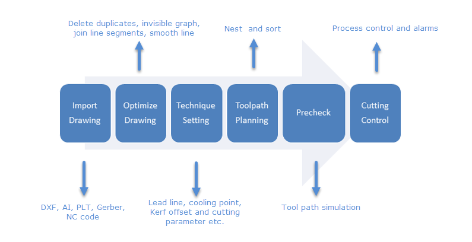
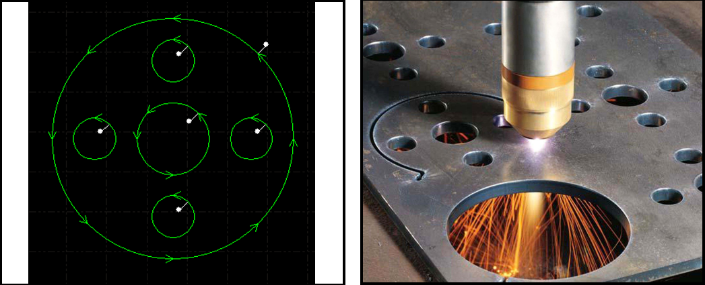
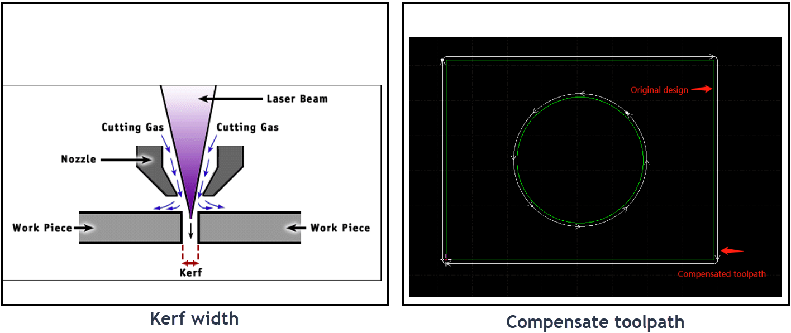
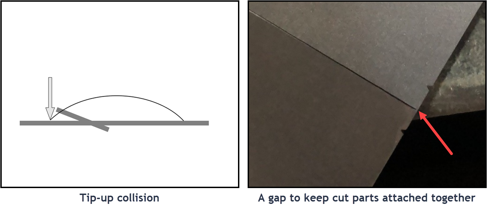
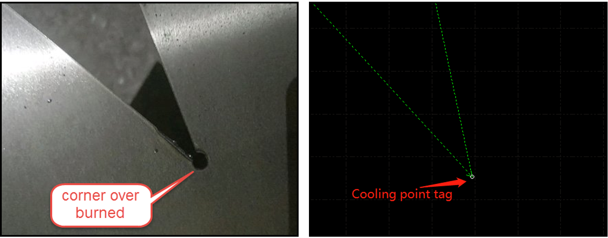

# 00 这活儿到底是怎么干的

[简体中文](./00-why-this-works.md) | [English](../../en/learn/00-why-this-works.md)

写给没摸过切割软件的人。先看这页，再往下走。

## 整件事就一句话

电脑上把图弄对、把顺序排好，机床上找正板、空跑一圈，然后切第一件、量尺寸。  
参数永远是「这块料 + 这台机 + 这一行工艺」的，抄行，别发明。

## 六步



图是柏楚官方教程的总览。对着软件走一遍：

| 步骤 | 干什么 | 不干会怎样 |
|---|---|---|
| 导入图纸 | 把形状放进来 | 什么都没有 |
| 优化图纸 | 量尺寸、堵开口、去重线 | 尺寸错，一道线切两遍 |
| 工艺 | 引线、补偿、微连、冷却点 | 烧边、尺寸偏、零件飞 |
| 路径 | 先孔后框 | 先切外框，片子掉下来乱撞 |
| 加工前检查 | 模拟 / 走边框 / 空走 | 撞板，或切到床外 |
| 加工控制 | 开始、暂停、断点 | — |

模拟、空走、出光，三回事：

- 模拟：机床不动，光也不出。屏幕上看路径。
- 走边框 / 空走：机床动，光不出。看范围和撞不撞。
- 加工：动，出光。

## 引线、补偿、微连、冷却点

四个都是给激光的副作用擦屁股。



引线：从零件边上直接下刀会烧出疤。所以先在废料里穿孔，再走上轮廓。你会多出一小段进刀线。



补偿：激光烧掉一条缝。不偏置的话外轮廓小一圈，孔大一圈。刀路往外或往内挪大约半个缝宽。缝宽以实测为准，别抄别人的数。



微连：切通的片子会翘、会掉，撞头。故意留一小段不切断，片子还挂在废料框上，最后手掰。



冷却点：尖角热量堆着，容易烧糊。走到角上停一下、关光、吹气，再走。

微连防翘，冷却点防烧角。两回事。轨迹上缺口是微连，实心点是冷却点。

## 练习件

后面都用这块 80×40 的双孔片，不换例子。

```text
┌──────────────┐
│  ○        ○  │
│              │
└──────────────┘
```

文件在这儿：[ex01-double-hole-plate.dxf](../../../exercises/dxf/ex01-double-hole-plate.dxf)

没机床也能练：演示模式把六步走完。

## 没人带的时候

电脑上的活全可以自己练。机床上自己动手前，把第 5 课那 60 秒背下来：急停在哪、罩关没关、排烟、报警栏。不清楚就停，别猜按钮。

## 顺序

00 本页 → [01 认界面](01-ui-tour.md) → [02 导图](02-first-import.md) → [03 工艺](03-first-technique.md) → [04 检查](04-first-precheck.md) → [05 上机](05-first-on-machine.md)

卡了看 [卡住手册](00-stuck.md)
