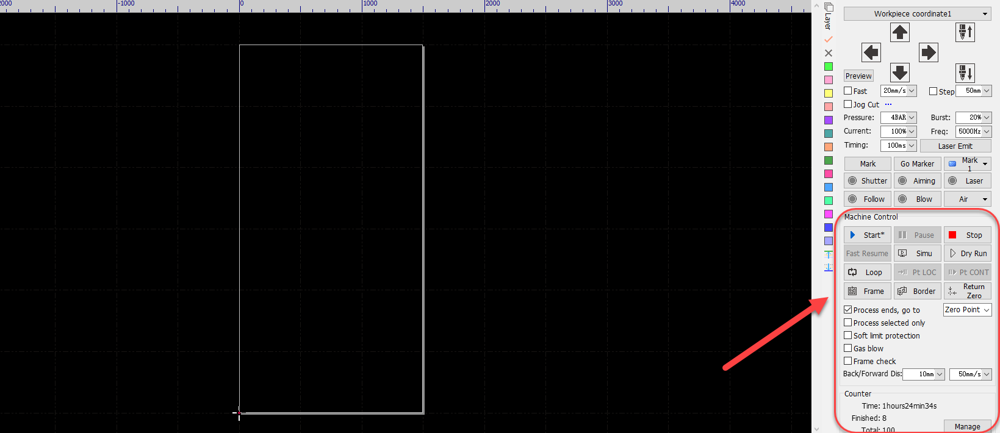
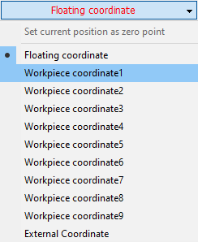
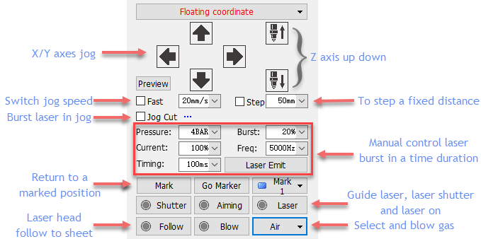
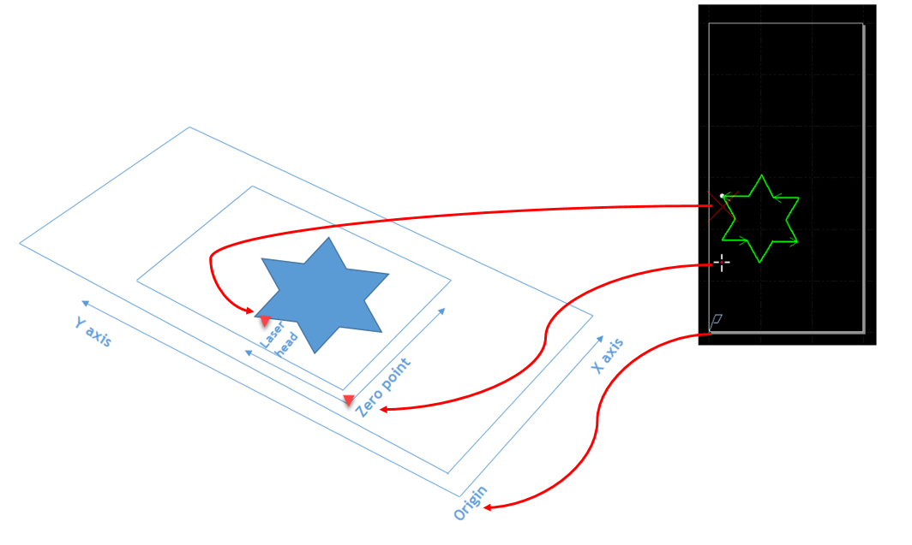
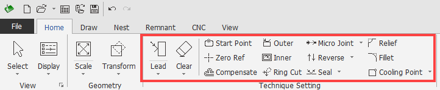
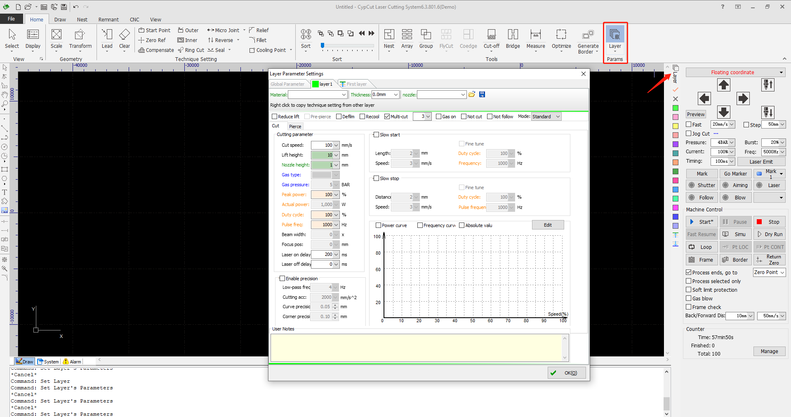
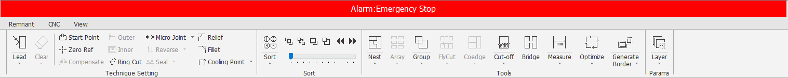

# 01 · 认界面（真实截图）

[简体中文](./01-ui-tour.md) | [English](../../en/learn/01-ui-tour.md)

> **你只需要做到**：看一眼截图，能在自己软件上指认「上面菜单 / 中间图 / 右边工艺 / 底下报警 / 控制台」。  
> 截图来自 **柏楚官方 CypCut 教程**。你装的是 CypCutE / CypCutPro 时布局可能不同，但**区域逻辑一样**。以你屏幕上的文字为准。

---

## 1. 总览：屏幕分 5 块

```text
┌──────────────────────────────────────────┐
│ 菜单/功能区（文件 绘图 工艺 数控…）        │  ← 点这里“做事”
├──────────────────────────────────────────┤
│                                          │
│           绘图板（零件在这里）             │  ← 看这里“长什么样”
│                                          │
├──────────────────────────────────────────┤
│ 控制台：开始 暂停 停止 模拟 预览…          │  ← 点这里“让机床动”
│ 报警栏 / 日志                              │  ← 出事先看这里
└──────────────────────────────────────────┘
```

---

## 2. 控制台（加工控制）



*图 01-1 控制台 · 来源：Bochu Machining Control。*

**死记这 5 个动作：**

| 按钮语义 | 点了会怎样 | 成功长什么样 |
|---|---|---|
| 开始 Start | 按刀路加工（出光） | 路径变色推进 |
| 暂停 Pause | 停在当前位置 | 可前进/后退 |
| 停止 Stop | 结束本轮 | 头回预设位置 |
| 模拟 / 预览 | 只看路径/范围 | **机床不动** |
| 走边框 / 空走 | 机床空跑 | **机床动，不出光** |

---

## 3. 坐标：浮动 vs 工件



*图 01-2 坐标 · 来源：Bochu Machining Control。*

- **浮动坐标**：零点 = 激光头**现在站的位置**。适合「就地对一下」。  
- **工件坐标**：零点 = 床上**固定参考点**。适合批量、有基准。

初学只用记住：**上机后要回原点**，坐标系才靠谱。

---

## 4. 加工前你会用到的三件检查



*图 01-3 手动开关激光/气/指示光、点动 · 来源：Machining Precheck。*



*图 01-4 预览：头 / 零件 / 行程范围相对位置。*


*图 01-5 走边框 vs 轮廓边 vs 空走。*

| 名称 | 走什么 | 机床 |
|---|---|---|
| Frame 走边框 | 零件外接方框 | 动 |
| Border | 最外轮廓 | 动 |
| Dry Run 空走 | 完整刀路 | 动，不出光不出气 |

---

## 5. 工艺区长什么样



*图 01-6 工艺 / 图层参数区。*



*图 01-7 每层可设切割与穿孔参数。*

---

## 6. 报警栏



*图 01-8 报警信息在顶部标题栏。*

**报警了怎么办（自己能做的）**：  
1. **停止**，别硬切。  
2. **截图/抄下报警原文**。  
3. 对照 [卡住手册](00-stuck.md) 查现象。  
4. 查不清 → 停机，带报警信息找人。

---

## 7. 跟做 3 分钟（不用机床）

1. 打开你的软件（或演示模式）。  
2. 指认并说出：绘图板在哪、控制台在哪、报警在哪。  
3. 找到「模拟」按钮（只点模拟，不点开始）。  
4. 对照图 01-1，在自己屏幕上找 Start / Pause / Stop 位置写进笔记本。

**过关标准**：能在自己屏幕上指出 5 个区域；知道模拟机床不动。

---

## 下一步

[02 第一次导图](02-first-import.md)
