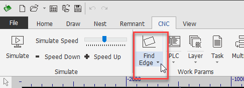
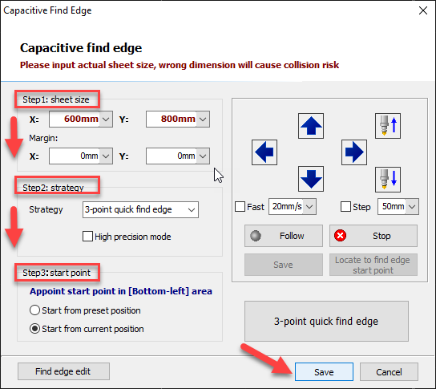

# 05 上机

[简体中文](./05-first-on-machine.md) | [English](../../en/learn/05-first-on-machine.md)

每台机按钮不一样，顺序看该机 SOP 和机身上的标。下面这套是通用骨架。

## 开切前背这六条

1. 急停在哪，手拍得到  
2. 罩关了  
3. 排烟开了  
4. 水冷、气没报警  
5. 软件报警栏是空的  
6. 不知道就停，不猜  

背不全别开切。

## 第一次自己上的顺序

上电 → 回原点 → 慢速点动各轴 → 放板关罩 → 寻边 → 走边框 → 空走 → 用现场验证过的工艺行切第一件 → 量、拍照、记参数。

官方写过的注意：先回原点；板材尺寸别填错，填错会撞齿条；斜角别太大，十几度就过分了；头要在板内再开寻边。

## 工艺从哪来

问现场这块料有没有验证过的行。有就整行抄：厚度、喷嘴、气体、速度、功率、气压、焦点。  
没有就别切，或者等别人给整行再试。  
切完把参数和结果记下来。这是你自己的资产。

## 出事

报警：停，抄原文。别狂点复位接着干。  
切不透：停，查喷嘴、速度、是不是抄错行。  
尺寸不对：先查补偿方向和单位。  
异响、撞：急停。

---

卡了：[卡住手册](00-stuck.md)
