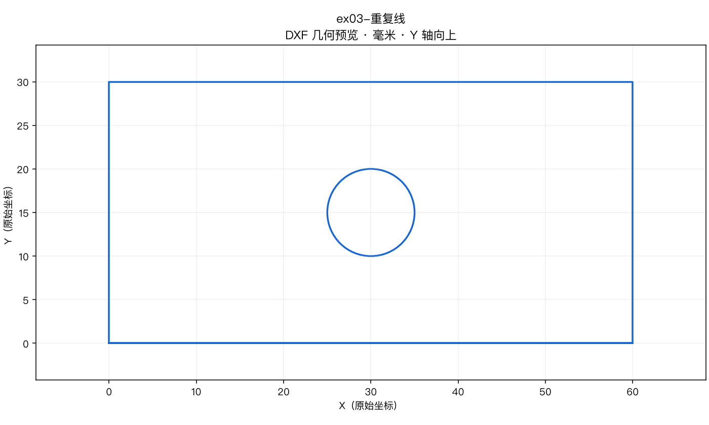
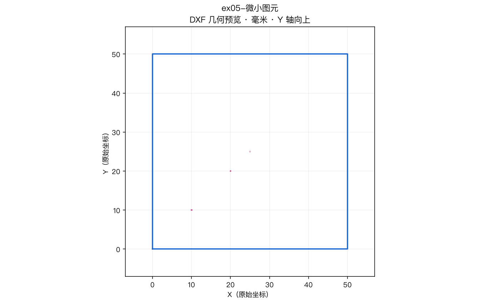
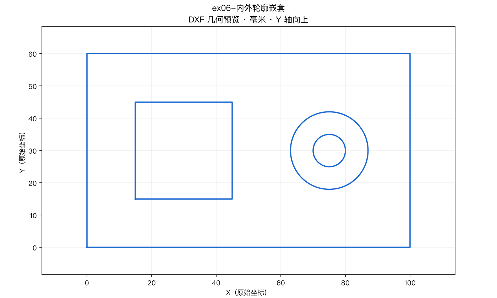

# Exercises · 练习

[简体中文](README.md) | [English](README.en.md)

Offline drawing pack. One shared DXF geometry set; previews and answers per language.  
**Offline only — not validated for direct machine cutting.**

| ID | DXF | Intentional issue |
|---|---|---|
| ex01 | [ex01-double-hole-plate.dxf](dxf/ex01-double-hole-plate.dxf) | running-case plate |
| ex02 | [ex02-wrong-units.dxf](dxf/ex02-wrong-units.dxf) | `$INSUNITS=inch` vs mm geometry |
| ex03 | [ex03-duplicate-lines.dxf](dxf/ex03-duplicate-lines.dxf) | collinear bottom duplicates |
| ex04 | [ex04-open-contour.dxf](dxf/ex04-open-contour.dxf) | lower-left gap of 2 units |
| ex05 | [ex05-tiny-entities.dxf](dxf/ex05-tiny-entities.dxf) | tiny lines and r=0.03 circle |
| ex06 | [ex06-nested-contours.dxf](dxf/ex06-nested-contours.dxf) | outer / inner square / circle-in-circle |
| ex07 | [ex07-layer-process.dxf](dxf/ex07-layer-process.dxf) | CUT/MARK/TEXT0 source layers |
| ex08 | [ex08-multi-part-layout.dxf](dxf/ex08-multi-part-layout.dxf) | 3 single-hole parts + SHEET |

Geometry report: [dxf-structure-report.json](dxf-structure-report.json)

## Previews

## Answers

- [ex01](answers/en/ex01-double-hole-plate.md)
- [ex02](answers/en/ex02-wrong-units.md)
- [ex03](answers/en/ex03-duplicate-lines.md)
- [ex04](answers/en/ex04-open-contour.md)
- [ex05](answers/en/ex05-tiny-entities.md)
- [ex06](answers/en/ex06-nested-contours.md)
- [ex07](answers/en/ex07-layer-process.md)
- [ex08](answers/en/ex08-multi-part-layout.md)

## Scripts

`scripts/generate_dxf.py`, `scripts/render_previews.py` (need ezdxf + Pillow).

## Scoring

- Pass: matches JSON geometry and no safety errors (e.g. claiming simulate fires the laser).
- Wrong hole counts/locations: fail.
