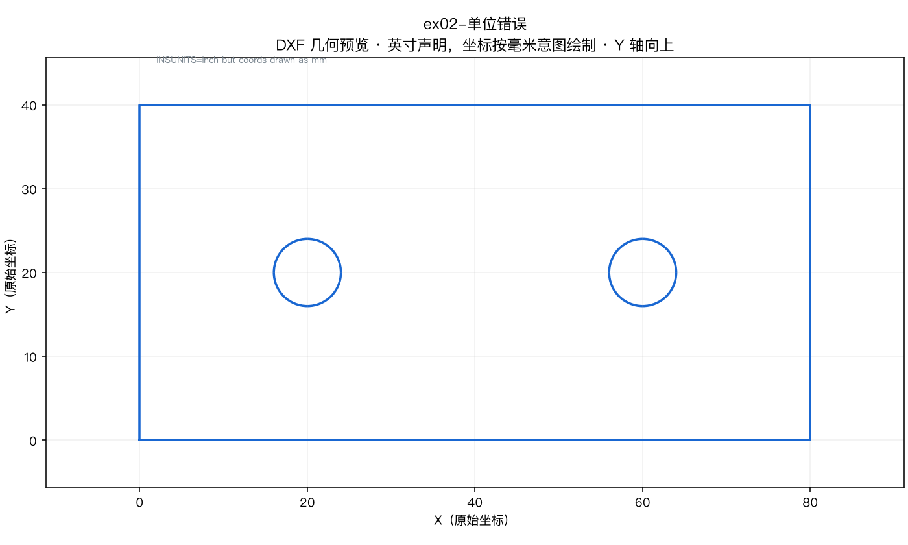

# 练习 Exercises

[简体中文](README.md) | [English](README.en.md)

离线图纸练习包。DXF 共用一套几何；预览与答案分语言。  
声明：**离线练习，未验证可直接上机加工。**

## 文件

| ID | DXF | 故意保留的问题 |
|---|---|---|
| ex01 | [ex01-double-hole-plate.dxf](dxf/ex01-double-hole-plate.dxf) | 标准连接片（贯穿案例） |
| ex02 | [ex02-wrong-units.dxf](dxf/ex02-wrong-units.dxf) | `$INSUNITS=inch` 与毫米几何不一致 |
| ex03 | [ex03-duplicate-lines.dxf](dxf/ex03-duplicate-lines.dxf) | 底边共线重复 |
| ex04 | [ex04-open-contour.dxf](dxf/ex04-open-contour.dxf) | 左下开口 2 单位 |
| ex05 | [ex05-tiny-entities.dxf](dxf/ex05-tiny-entities.dxf) | 0.05 级微段与 r=0.03 圆 |
| ex06 | [ex06-nested-contours.dxf](dxf/ex06-nested-contours.dxf) | 外框/内方/圆中圆 |
| ex07 | [ex07-layer-process.dxf](dxf/ex07-layer-process.dxf) | CUT/MARK/TEXT0 源图层 |
| ex08 | [ex08-multi-part-layout.dxf](dxf/ex08-multi-part-layout.dxf) | 3 件单孔 + SHEET 参考框 |

几何报告：[dxf-structure-report.json](dxf-structure-report.json)

## 预览

## 答案

- [ex01 双孔连接片](answers/zh-CN/ex01-double-hole-plate.md)
- [ex02 单位错误](answers/zh-CN/ex02-wrong-units.md)
- [ex03 重复线](answers/zh-CN/ex03-duplicate-lines.md)
- [ex04 开口轮廓](answers/zh-CN/ex04-open-contour.md)
- [ex05 微小图元](answers/zh-CN/ex05-tiny-entities.md)
- [ex06 内外轮廓嵌套](answers/zh-CN/ex06-nested-contours.md)
- [ex07 工艺分层](answers/zh-CN/ex07-layer-process.md)
- [ex08 多件布局](answers/zh-CN/ex08-multi-part-layout.md)

## 脚本

`scripts/generate_dxf.py`、`scripts/render_previews.py`（生成/预览，依赖 ezdxf + Pillow）。

## 判分

- 通过：与 JSON 几何一致，且无安全错误（例如把模拟说成会出光）。
- 位置/孔数写错：未通过。
